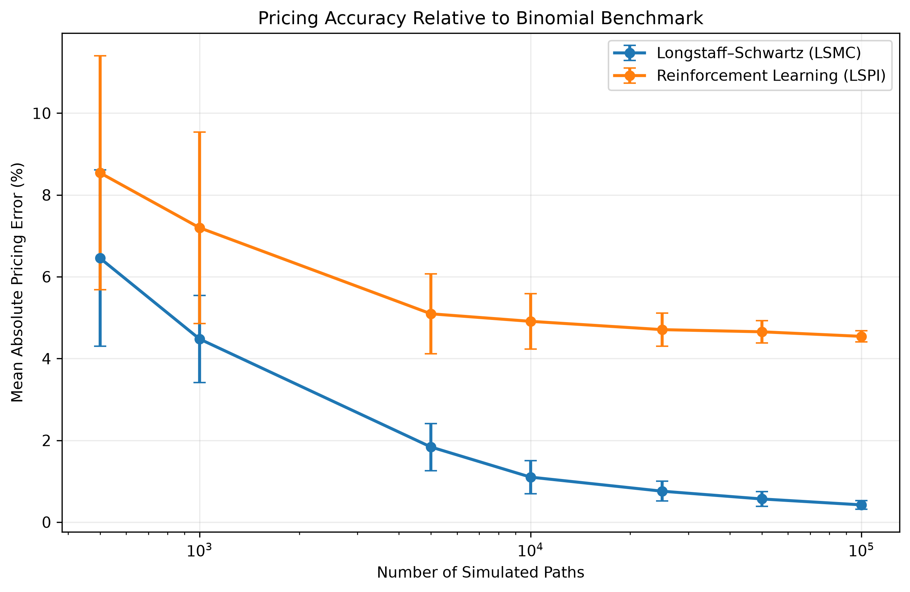
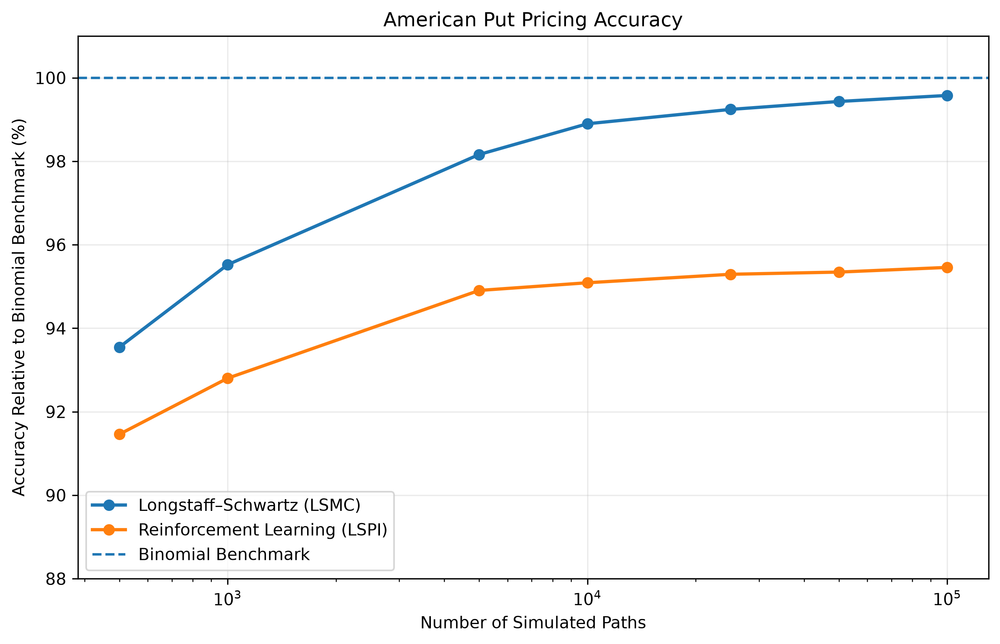
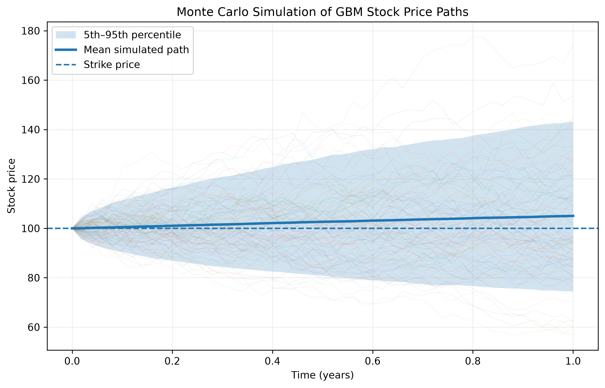

# Comparing Longstaff-Schwartz and Reinforcement Learning for American Option Pricing

This independent project compares Longstaff-Schwartz Monte Carlo (LSMC) with Least-Squares Policy Iteration (LSPI), a reinforcement-learning approach, for pricing an American put option.

Both methods are evaluated under the same geometric Brownian motion model and compared with a Cox-Ross-Rubinstein binomial-tree benchmark.

## Main Result

Across Monte Carlo sample sizes from 500 to 100,000 paths, LSMC converged progressively towards the benchmark. At 100,000 paths, its mean absolute percentage error was approximately 0.42%, compared with 4.54% for LSPI.

The LSPI policy also learned a lower exercise boundary than the binomial benchmark, helping explain its persistent downward pricing bias.

## Method

The experiment prices an at-the-money American put option under geometric Brownian motion using three approaches:

- **Cox-Ross-Rubinstein binomial tree** as the numerical benchmark
- **Longstaff-Schwartz Monte Carlo (LSMC)** using least-squares regression to estimate continuation values
- **Least-Squares Policy Iteration (LSPI)** using reinforcement learning to learn an exercise policy

Seven Monte Carlo training sample sizes were tested:

`500`, `1,000`, `5,000`, `10,000`, `25,000`, `50,000`, and `100,000` paths.

Each experiment was repeated 20 times using different random seeds.

## Results

LSMC became increasingly accurate as the number of simulated paths increased, while LSPI improved initially but its pricing error began to level off at larger sample sizes.

At 100,000 paths:

| Method | Mean Price | Mean Absolute Error | Percentage Error |
| --- | ---: | ---: | ---: |
| Binomial benchmark | 6.0785 | — | — |
| LSMC | 6.0528 | 0.0257 | 0.42% |
| LSPI | 5.8024 | 0.2761 | 4.54% |

The LSPI estimates became increasingly stable as more paths were added, but remained systematically below the benchmark.

## Stock-Price Simulation

The underlying stock is simulated under geometric Brownian motion. Each simulated path represents one possible evolution of the stock price from the present until the option's maturity.

## Exercise Policy

The pricing results were also examined through the exercise policies learned by the models.

At halfway through the option's life, the binomial benchmark produced an exercise boundary of approximately 84.87.

The LSPI policy exercised at a stock price of 70 but continued at 75, implying an exercise boundary between these values. This lower boundary means that LSPI continues to hold the option in some states where the benchmark would exercise, providing a possible explanation for its downward pricing bias.

## Files

- [`Paper.pdf.pdf`](Paper.pdf.pdf) – full research-style paper
- [`American_Option_Pricing.ipynb`](American_Option_Pricing.ipynb) – Python implementation and numerical experiments
- [`gbm_monte_carlo_simulation.png`](gbm_monte_carlo_simulation.png) – simulated GBM stock-price paths
- [`pricing_error_percentage.png`](pricing_error_percentage.png) – LSMC and LSPI pricing-error comparison
- [`pricing_accuracy_lsmc_vs_lspi.png`](pricing_accuracy_lsmc_vs_lspi.png) – comparison with the binomial benchmark

## Model Parameters

| Parameter | Value |
| --- | ---: |
| Initial stock price | 100 |
| Strike price | 100 |
| Risk-free rate | 5% |
| Dividend yield | 0% |
| Volatility | 20% |
| Maturity | 1 year |
| Exercise intervals | 50 |

## About

This project was completed independently following LSE Summer School ME319: Machine Learning and Stochastic Simulation.

The aim was to apply Monte Carlo simulation, stochastic modelling and reinforcement learning to a practical quantitative-finance problem and investigate how the two numerical methods behave as the amount of simulation data increases.
